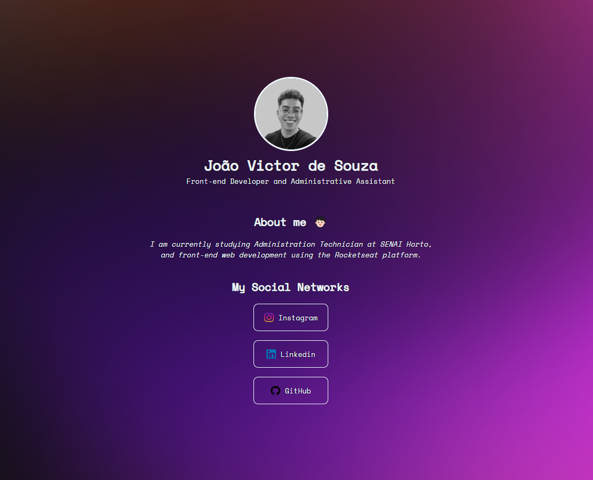

# Linktree Clone

Este projeto é uma aplicação simples de **Linktree**, desenvolvida com **HTML** e **CSS**. O objetivo é criar uma página que centraliza links importantes, permitindo que os usuários acessem várias URLs de forma rápida e prática.

## 🛠️ Tecnologias Utilizadas

- **HTML5**: Estruturação semântica do conteúdo.
- **CSS3**: Estilização da página, com foco em design limpo e atraente.

## 📸 Screenshots

    

## 🚀 Funcionalidades

- **Links Personalizados**: Adicione links que direcionam para diferentes páginas ou perfis sociais.
- **Estilização Simples**: Utiliza CSS para criar uma apresentação visual atraente e funcional.

## 📝 Aprendizados

- **Estruturação com HTML**: Aprendi a organizar o conteúdo de uma página web utilizando HTML de forma semântica.
- **Estilização com CSS**: Pratiquei a criação de estilos visuais usando CSS para aprimorar a apresentação do conteúdo.
- **Design Responsivo**: Desenvolvi habilidades em design responsivo, garantindo que a página funcione bem em diversos dispositivos.

